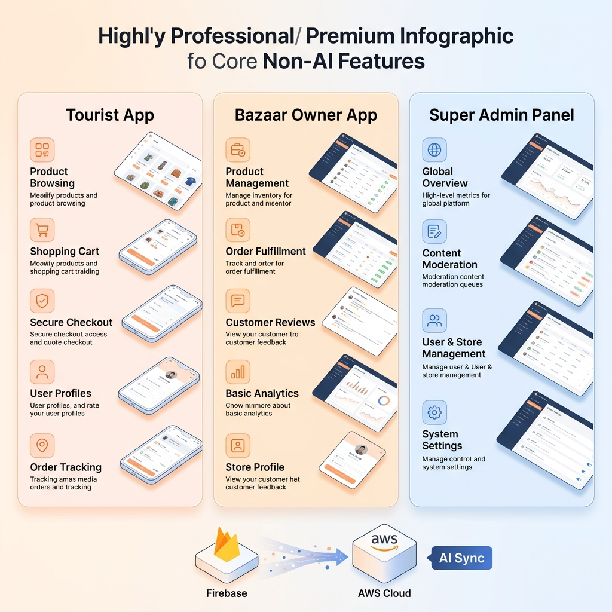
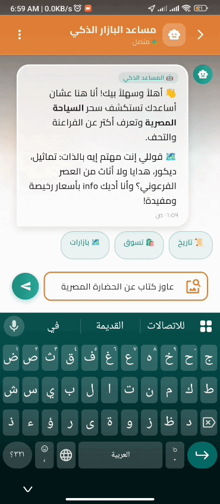
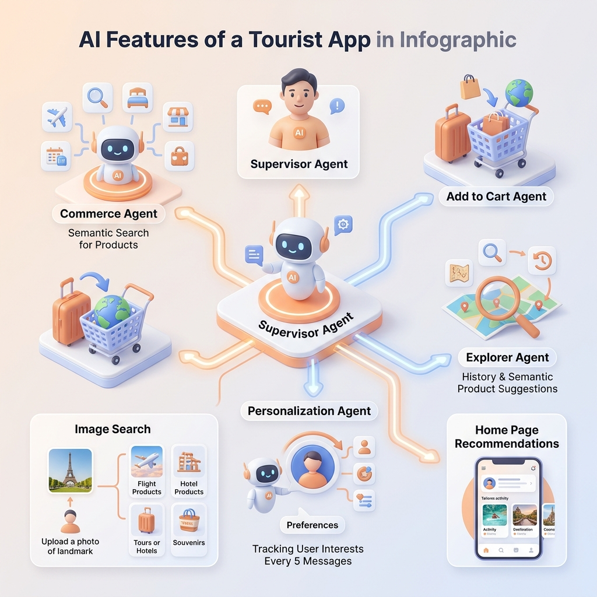
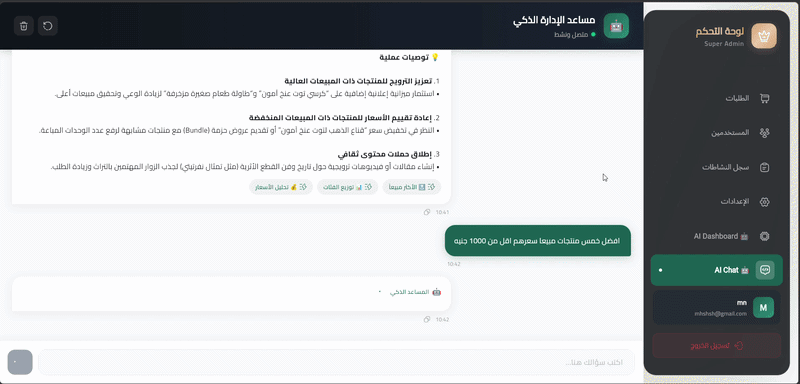
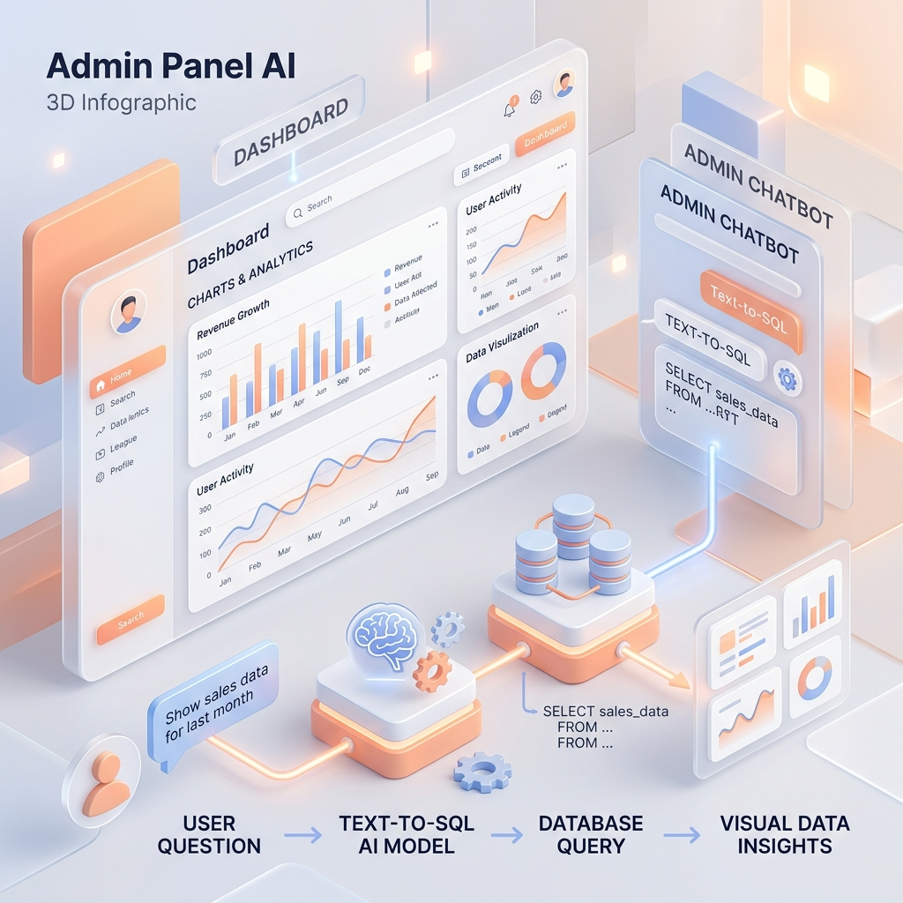
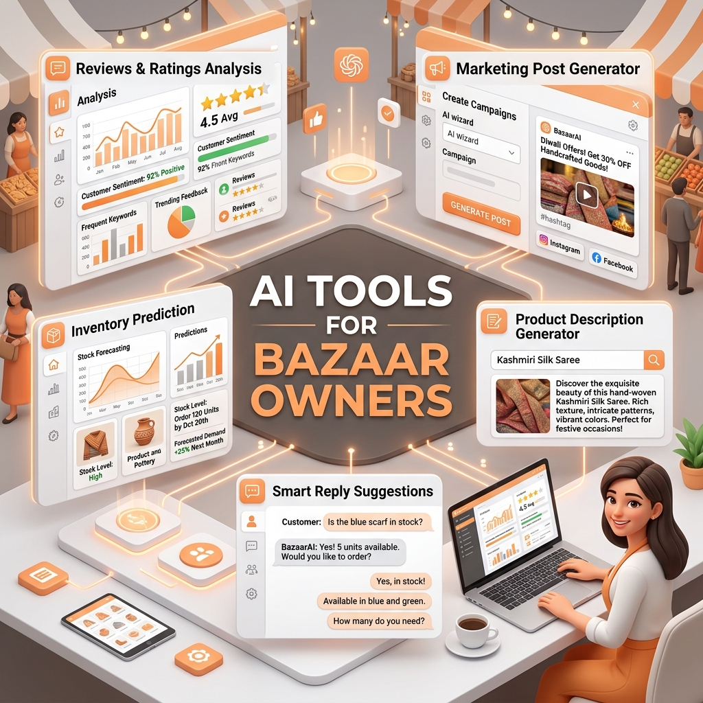
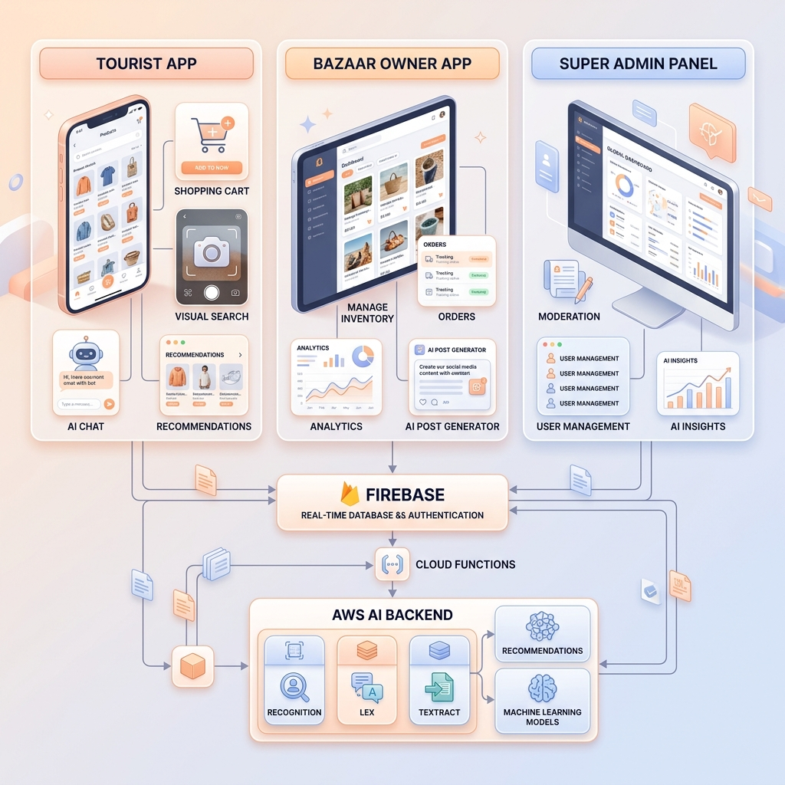

# 🏺 Egypt Bazaars
**An Enterprise-Grade, AI-Powered Digital Broker Platform for Cultural Tourism**

[Live Admin Dashboard](https://egyptian-tourism-app.web.app) • [Download Mobile Applications](https://drive.google.com/drive/folders/1GzeHBvZLwB5JfetHZw_A1RVS4-A5PVXY?usp=sharing)

---

## 📖 Executive Summary & Problem Domain

The cultural tourism sector in Egypt draws millions of international visitors annually. A cornerstone of this experience is the acquisition of authentic cultural souvenirs. However, the traditional bazaar shopping ecosystem presents significant friction: tourists often face fragmented product discovery, language barriers, inconsistent pricing, and concerns regarding historical authenticity. Conversely, local artisans and bazaar owners lack the digital infrastructure required to scale their operations, manage inventory, and seamlessly interact with a global customer base.

**Egypt Bazaars** was engineered to solve these precise challenges. It operates as an intelligent digital intermediary—a centralized marketplace that digitally transforms traditional commerce. By bridging the gap between tourists and local bazaars, the platform ensures transparency, enforces data-driven trust, and delivers a frictionless, hyper-personalized shopping experience powered by cutting-edge artificial intelligence.

---

## 🧠 Core System Architecture & AI Paradigm

The backbone of Egypt Bazaars is a sophisticated, decoupled microservices architecture designed for extreme scalability, low latency, and robust data integrity. 

To deliver next-generation user experiences, the platform leverages a **Multi-Agent Architecture** orchestrated exclusively by **LangGraph** and **LangChain**. Rather than relying on simple, rigid logic, the system deploys specialized AI workflows capable of complex reasoning and contextual understanding. 

**Cloud & Infrastructure:**
The entire backend ecosystem is proudly hosted on **AWS**, utilizing an **AWS-hosted Database** for maximum reliability. Data synchronization across the platform is handled seamlessly via **Cloud Functions**, ensuring real-time consistency between the mobile apps and web dashboards. The system also features a robust **Push Notification** pipeline to keep tourists and owners instantly updated on order statuses and AI alerts.

  
   
  <i>High-level mapping of the system's core capabilities and operational workflows.</i>

---

## 🚀 The Platform Ecosystem

The Egypt Bazaars ecosystem is comprised of three distinct, highly optimized interfaces. Each interface is uniquely designed to serve its target stakeholders, encompassing complete business logic along with specialized AI features tailored to that specific user base.

### 🌍 1. The Tourist Application: The Ultimate Digital Companion

The Tourist application is the flagship mobile product designed to provide international and domestic visitors with a seamless, immersive, and culturally enriching shopping journey. It transforms how tourists discover and purchase authentic Egyptian artifacts.

**Core Application Features:**
* **Comprehensive Catalog Browsing:** Tourists can explore a vast array of authentic souvenirs, categorized by historical era, material, and specific bazaars. Advanced filtering and search functions allow users to find exact matches for their needs.
* **Cultural Transparency & Authenticity:** Every product page is enriched with deep historical backgrounds, manufacturer details, and authenticity indicators.
* **End-to-End Order Management:** Users can securely place orders, track real-time fulfillment statuses, and review their historical purchase timelines.
* **Community & Trust Building:** The app includes features to curate a favorites list, submit verified reviews, rate past purchases, and report any issues.

**🤖 AI Integration & Capabilities (Focus):**
The application seamlessly integrates advanced intelligence to guide the tourist:
* **Multi-Agent Chatbot System:** A sophisticated virtual assistant powered by a team of specialized AI agents working together:
  * **Supervisor Agent:** The entry point. It receives the user's message, understands the core intent, and seamlessly routes the conversation to the most appropriate specialized agent.
  * **Commerce Agent:** Handles shopping queries. It uses **Semantic Search** to understand the meaning behind the user's request and fetches the most contextually relevant products.
  * **Cart Agent:** An automated assistant dedicated entirely to managing the user's shopping cart and facilitating the addition of items.
  * **Explorer Agent:** The cultural storyteller. If a user asks about a historical figure (e.g., King Tutankhamun), this agent provides rich historical context and then proactively uses Semantic Search to recommend products related to that specific story.
  * **Personalization Agent:** Operates in the background. Every 5 messages, it analyzes the conversation, extracts the user's emerging interests, and saves them. These insights are then fed directly into the system's Recommendation Engine to update the user's personalized "Home Page" feed.
* **Visual Search (Search by Image):** Tourists can simply upload or take a picture of an item they like. The AI processes the image and instantly retrieves visually and contextually similar products from the marketplace inventory.

  <b>1. Main Platform Discovery</b>  
  

 

  <b>2. Intelligent AI Search (Semantic & Visual)</b>  
  
  &nbsp;&nbsp;&nbsp;&nbsp;&nbsp;&nbsp;
  
    
  
  &nbsp;&nbsp;&nbsp;&nbsp;&nbsp;&nbsp;
  

 

  

---

### 🛡️ 2. The Super Admin Dashboard: Centralized Command & Governance

Operating at the apex of the platform, the Web Dashboard provides system administrators with absolute visibility and control over the marketplace. It is the core governance tool used to maintain platform integrity and ensure compliance.

**Core Application Features:**
* **Verification & Compliance:** Administrators review submitted commercial documents to verify and approve new Bazaar Owners.
* **Content Moderation:** Full control to monitor active listings, suspend violating accounts, and review user reports.
* **Interactive Dashboards:** Comprehensive visual charts, graphs, and performance metrics tracking revenue, orders, and system growth.

**🤖 AI Integration & Capabilities (Focus):**
* **Text-to-SQL Analytics Chatbot:** Administrators have access to a highly specialized, internal AI chatbot. Instead of manually writing complex database queries, the Admin can ask questions in natural language (e.g., *"Show me the total revenue from Papyrus sales this month"*). The AI dynamically converts the question into an SQL query, executes it against the AWS database, and returns the precise insights instantly.
* **Data-Driven Recommendation Dashboard:** The system ingests platform-wide data and produces automated recommendations for the administrators to optimize marketplace performance.

  <b>Admin AI Chatbot & Dashboard Analytics</b>  
  
    
  

 

  

---

### 🏪 3. The Bazaar Owner Application: Artisan Digital Empowerment

A specialized mobile application engineered specifically for local sellers and artisans. It abstracts away the complexity of traditional e-commerce infrastructure, providing them with a streamlined portal to digitize their inventory and scale.

**Core Application Features:**
* **Digital Inventory Management:** Owners can instantly add, edit, or hide souvenir listings, update pricing, and upload product media.
* **Order Processing Hub:** A dedicated interface to review incoming tourist orders, accept or reject requests, and update fulfillment statuses.
* **Customer Interaction:** Owners can directly respond to tourist reviews and handle inquiries to build their brand.

**🤖 AI Integration & Capabilities (Focus):**
The Bazaar Owner application acts as a personal business consultant, packed with AI features to maximize merchant success:
* **Bazaar-Specific Analytics & Recommendations:** The dashboard provides deep statistical analysis and charts tailored specifically to the owner's bazaar, tracking sales performance and customer trends.
* **Review & Customer Feedback Analysis:** Automatically scans customer ratings and comments to extract sentiment, highlighting exactly what tourists love and what needs improvement.
* **Inventory & Quantity Prediction:** Analyzes sales velocity to predict future stock requirements, telling the owner exactly how much inventory they need to order before running out.
* **Smart Social Media & Campaign Generator:** Instantly generates professional marketing posts and statuses tailored to various business scenarios (e.g., Seasonal campaigns, special offers, sales boosting, or attracting new customers).
* **Smart Customer Replies:** Suggests professional, context-aware responses to incoming tourist messages, saving the owner time.
* **Automated Product Descriptions:** The owner simply inputs the product name, and the AI automatically generates a compelling, culturally rich product description ready for publishing.

  <b>Bazaar Owner Smart App in Action</b>  
  

 

  

---

## 🏗️ Technical Stack & Infrastructure Design

The technological foundation of Egypt Bazaars is built upon modern, industry-standard frameworks ensuring high availability, fault tolerance, and cross-platform compatibility.

#### Client & Presentation Layer
* **Framework:** Flutter & Dart (Single codebase for iOS, Android, and Web).
* **State & Routing:** Provider/Riverpod for state management, GoRouter for declarative navigation.

#### Cloud Infrastructure & Backend
* **Hosting & Database:** Proudly hosted entirely on **AWS**, utilizing an AWS-hosted database for enterprise-grade scalability.
* **Data Synchronization:** Real-time data sync powered by **Cloud Functions**.
* **Authentication:** Firebase Auth (Secure token-based JWT authentication).
* **Storage & Messaging:** Firebase Cloud Storage for media, Firebase Cloud Messaging (FCM) for comprehensive push notifications.

#### AI Microservices & Data Processing
* **API Framework:** FastAPI running on Uvicorn (Asynchronous, ultra-low latency).
* **AI Orchestration:** Python, LangChain, LangGraph.

   
  

---

  <i>Developed as a Graduation Project (Part 2 - 2025/2026) for Luxor University, Faculty of Computer and Information.</i>

